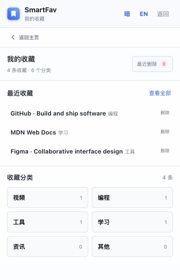

# SmartFav 智能收藏夹

一款本地优先、AI 可选增强的 Chrome / Edge 浏览器收藏插件，支持中英文界面和浏览器原生收藏夹同步。

点击插件图标后，SmartFav 会打开 Edge / Chrome 原生工具栏插件弹窗，并根据网页标题、网站标签、网址和描述自动建议分类。无需注册账号，也不需要配置 AI；需要更智能的判断时，可按需启用本机 Ollama、现成云服务，或填写 OpenAI / Anthropic 兼容接口的地址、模型和 API Key。

## 1.12.0 更新

- 分类文件夹和分类内书签均支持鼠标拖动与键盘排序。
- 开启“同步浏览器收藏夹”后，手动调整的顺序会写回浏览器 `SmartFav / 分类`；关闭时仅保存在 SmartFav。
- 排序同步只移动已经存在的 SmartFav 受管项目，不创建空文件夹，也不改动 SmartFav 目录外的书签。
- 同网址有多个副本时保留全部副本及其相对顺序；未知书签、子文件夹及未匹配项目不会被删除。
- 浏览器中缺少对应项目或同步失败时，SmartFav 仍保留本地排序，并给出明确状态提示。

## Microsoft Edge 商店发布

- [隐私政策（中英双语）](PRIVACY.md)
- [Edge Add-ons 提交清单与可直接粘贴的权限说明](docs/edge-store-submission.md)
- [中文商店截图（1280 × 800）](docs/store-assets/smartfav-edge-store-zh-1280x800.png)
- [English store screenshot (1280 × 800)](docs/store-assets/smartfav-edge-store-en-1280x800.png)

公开的隐私政策地址：

<https://github.com/003jia/SmartFav/blob/main/PRIVACY.md>

## 特点

- **无需 AI 也能使用**：本地关键词权重或关键词向量匹配完成基础分类，默认不上传网页内容。
- **原生工具栏弹窗**：点击插件图标打开，点击弹窗外部即可关闭，不注入网页也不创建独立窗口。
- **弹窗尺寸可调**：宽度支持 320–520px，高度支持 420–600px，收藏、分类和设置仍保持紧凑。
- **独立功能界面**：主页只负责收藏当前网页，“我的收藏”和“分类文件夹”分别进入独立界面。
- **清晰的收藏卡片**：分类内收藏以紧凑卡片显示，标题最多两行并附网站域名；删除操作使用独立区域，操作后保持在当前分类。
- **手动拖拽排序**：收藏分类可拖动调整位置，分类内书签可拖动调整顺序；顺序在浏览器本地持久保存，开启浏览器收藏夹同步后还会写回 `SmartFav / 分类`，最近收藏仍保持独立的时间顺序。
- **明确返回路径**：“我的收藏”和“分类文件夹”内容区顶部均有返回主页按钮。
- **统一品牌图标**：工具栏和弹窗标题区使用同一套多尺寸 SmartFav 图标。
- **方形外框**：使用浏览器原生矩形画布，不再处理外层圆角、透明底板或悬浮窗尺寸同步。
- **界面风格与背景**：支持五种主题、明暗模式和本地自定义背景图片；黑色风格固定使用白字暗色。
- **自定义分类文件夹**：在独立分类界面新增或删除文件夹，并为每个文件夹单独填写关键词规则；支持中英文逗号、分号或换行输入，并自动规范为英文逗号。
- **已有收藏重新分类**：保存新文件夹或关键词规则后，自动重新检查全部 SmartFav 收藏并更新分类。
- **最近删除**：删除的收藏默认保留 7 天，可恢复或立即永久删除，到期后由后台自动清理。
- **中英文切换**：顶栏可即时切换中文和英文，Edge 商店也能识别两个语言版本。
- **浏览器收藏夹实时双向同步**：开启同步后，收藏会写入浏览器；在浏览器删除最后一条同网址书签时，SmartFav 会实时移入“最近删除”。
- **星标分类通知**：开启自动获取后，浏览器新建星标会立即分类，并用系统通知显示放入的分类文件夹。
- **安全整理**：关闭整理权限时只导入 SmartFav；开启后才会把浏览器原收藏移动到 `SmartFav / 分类`。
- **整理前布局备份**：每次批量整理或自动移动新星标前，先记录外部书签的原文件夹与顺序；可预览、幂等还原、导入或导出 JSON。
- **升级自动恢复**：重新加载或重新安装后，会从浏览器已有的 `SmartFav / 分类` 恢复收藏和自定义分类。
- **结果可解释**：显示分类来源和命中的关键词，收藏前可以手动修改。
- **AI 按需增强**：支持自动分类、创建新分类文件夹，并把本地标签比例和规则证据交给模型判断。
- **兼容两类 API 协议**：支持 OpenAI Chat Completions 格式和 Anthropic Messages 格式，自定义地址按站点单独授权。
- **分类策略可选**：可使用标签比例权重，或对分类文件夹中的关键词做本地向量相似度匹配。
- **规则可以自定义**：可编辑收藏分类与对应关键词。
- **避免重复收藏**：再次保存相同网址时自动更新原记录。

## 安装

1. 下载或克隆本仓库。
2. 打开 `chrome://extensions/` 或 `edge://extensions/`。
3. 开启“开发者模式”，点击“加载已解压的扩展程序”。
4. 选择仓库中的 `smartFav智能收藏夹` 文件夹。

安装后点击工具栏中的 SmartFav 图标即可打开原生插件弹窗。普通 `http://` 或 `https://` 网页可以收藏；`edge://`、扩展商店和其他浏览器保护页面仍可打开插件并查看已有收藏与设置，但浏览器不允许读取或收藏该页面。

AI 默认关闭。开启后可选择自动优化当前网页分类，也可以关闭自动模式，仅在点击“AI 优化”时调用所选模型服务；允许 AI 创建分类文件夹时，只有现有分类都不合适才会新增分类。

设置页的选项、开关、尺寸和 AI 配置均在更改后自动保存，不再需要页面底部的“保存设置”。星标自动获取可以只保存到 SmartFav，并在分类完成后显示系统通知；开启“允许整理浏览器收藏夹”后会立即整理现有收藏，之后新增星标也会自动移动到匹配分类。开启同步或自动获取时，浏览器删除最后一条同网址书签会把 SmartFav 记录移入“最近删除”；仍有同网址副本时不会误删。“覆盖同网址”会在整个浏览器收藏夹范围内去重。整理不会删除非重复网址收藏。

开启整理后，SmartFav 会先在扩展本地创建“整理前布局备份”，保存失败时不会移动任何浏览器书签。备份只记录当时仍在 `SmartFav` 外、即将被移动的书签；已经位于 `SmartFav / 分类` 的旧书签仍会被读取，但浏览器没有保存其整理前路径，因此只能显示“已识别现有分类”，不能伪造原位置。没有可还原记录时，预览、还原和导出按钮会禁用。还原不会删除备份之后新增的书签，也不会重新创建用户已经删除的书签；原文件夹缺失时会按记录路径重建。浏览器不允许扩展在卸载后继续运行，因此卸载前应手动还原或导出 JSON 布局备份。

更多配置和关键词规则说明见 [扩展使用文档](smartFav智能收藏夹/README.md)。
